  
  
  
  

---

## About

I am a final-year **B.Tech Computer Science** student at **Bennett University** (CGPA **8.17/10**, graduating May 2027), working mostly in **Java and Spring Boot** on the backend and **Python** for AI/ML.

---

## Tech Stack

**Languages**

**Backend**

**Databases**

**Frontend**

**Testing & Tooling**

**AI / ML**

---

## GitHub Stats

<picture>
  <source media="(prefers-color-scheme: dark)" srcset="./profile/stats-dark.svg" />
  <source media="(prefers-color-scheme: light)" srcset="./profile/stats-light.svg" />
  
</picture>
<picture>
  <source media="(prefers-color-scheme: dark)" srcset="./profile/top-langs-dark.svg" />
  <source media="(prefers-color-scheme: light)" srcset="./profile/top-langs-light.svg" />
  
</picture>

 

<picture>
  <source media="(prefers-color-scheme: dark)" srcset="https://streak-stats.demolab.com?user=uttkarsh-thakur26&hide_border=true&theme=tokyonight&background=00000000&ring=58a6ff&fire=58a6ff&currStreakLabel=58a6ff" />
  <source media="(prefers-color-scheme: light)" srcset="https://streak-stats.demolab.com?user=uttkarsh-thakur26&hide_border=true&background=00000000&ring=0969da&fire=0969da&currStreakLabel=0969da" />
  
</picture>

> The language card is weighted equally by repository count and bytes, so a single notebook repo carrying a large dataset does not drown out everything else.

---

## Featured Projects

### BillSync — group expense splitter

Members log what they paid, and BillSync works out who owes whom, then collapses that into the fewest sensible payments.

| | |
|---|---|
| **Exact-paisa splits** | Base share rounds down, the remainder is handed out one paisa at a time in ascending user-id order. Shares sum to the total exactly, never approximately, and the result is deterministic whatever order the client listed participants in. |
| **Debt simplification** | Greedy max-heap pairing of the largest creditor with the largest debtor. A 5-member group with 8 outstanding debts settles in 4 transfers, with a proven bound of at most n − 1. |
| **Money never touches a float** | `NUMERIC(12,2)` in Postgres, `BigDecimal` in Java, a string on the wire. |
| **Scale** | 16 REST endpoints, 6 tables under Flyway migrations, 73 automated tests. One slow screen went from 22 queries to 1 via `@EntityGraph`. |

### CodeNav AI — ask an unfamiliar codebase questions in English

A local RAG assistant. Clone any public repo, index it, then ask about it in plain English and get back the relevant code with file paths and line numbers.

- **AST-based chunking.** Python is split along real function and class boundaries rather than fixed-size blocks, so retrieved context arrives complete instead of severed mid-body.
- **Persistent FAISS index.** Opening a cached codebase dropped from **over 20 seconds to under 0.1**, a 99.5% improvement, by writing the index to disk instead of rebuilding it per session.
- **Smart refresh.** A `git pull` on the cached repo skips reindexing entirely when nothing changed.

### Motion Sensing System — human activity recognition

Recognises human activities from live video by fine-tuning **VGG16** rather than training from scratch, served as a live dashboard.

### Diabetes Risk Prediction

Classical ML pipeline for predicting diabetes risk from clinical indicators.

---

## Achievements

| | |
|---|---|
| **Smart India Hackathon 2024** | Ranked **101st nationally** |
| **LeetCode** | Contest rating **1500+** |
| **CodeChef** | **2-star** rated |
| **Hackaccino 2024** | Competed, Bennett University |

---

## Education & Certifications

**B.Tech, Computer Science and Engineering** — Bennett University, Greater Noida · Aug 2023 – May 2027 · **CGPA 8.17/10**

Coursework: Data Structures & Algorithms, Object-Oriented Programming, DBMS, Operating Systems, Computer Networks, Deep Learning, Neural Networks, System Design.

<strong>Certifications</strong>

 

- **Build Basic Generative Adversarial Networks (GANs)** — DeepLearning.AI via Coursera, Apr 2026
- **Neural Networks and Deep Learning** — DeepLearning.AI via Coursera, Apr 2025
- **Machine Learning: Clustering & Retrieval** — University of Washington via Coursera, Nov 2024

<strong>Research & Talks</strong>

 

**Agreement Loops in Multi-Agent Systems** — seminar talk, 2026. A literature review of how independent AI agents reach agreement with one another, covering what works today and what remains open.

---

### Get in touch

Open to **backend and AI/ML internships**. The fastest way to reach me is email.

  

